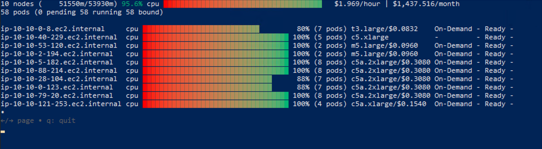

[](https://github.com/brunokktro/eks-node-viewer-for-windows/blob/main/LICENSE)
[](https://github.com/brunokktro/eks-node-viewer-for-windows/issues)
[](https://github.com/brunokktro/eks-node-viewer-for-windows/actions/workflows/test.yaml)
[](https://github.com/brunokktro/eks-node-viewer-for-windows/actions/workflows/test-windows.yaml)

# EKS Node Viewer for Windows 🪟

This is a **Windows-optimized fork** of the original [AWS Labs EKS Node Viewer](https://github.com/awslabs/eks-node-viewer) with enhanced Windows support, PowerShell scripts, and comprehensive Windows documentation.

## 📸 Windows PowerShell Demo



*EKS Node Viewer running natively on Windows PowerShell with full color support and Unicode rendering*

## 🆕 Windows Enhancements

- ✅ **PowerShell Build Scripts** - Native Windows build experience
- ✅ **Windows Terminal Support** - Optimized for modern Windows terminals
- ✅ **Comprehensive Windows Documentation** - Step-by-step Windows setup guide
- ✅ **Cross-Platform Configuration** - Smart platform detection and path handling
- ✅ **Windows CI/CD** - GitHub Actions for Windows testing
- ✅ **Enhanced Error Handling** - Windows-specific troubleshooting

## 🚀 Quick Start for Windows

### Option 1: Pre-built Release (Recommended) ⚡
**Fastest and easiest way to get started:**

1. Download the latest Windows binary from [Releases](https://github.com/brunokktro/eks-node-viewer-for-windows/releases/tag/v1.0.0-windows)
2. Extract `eks-node-viewer.exe` from the ZIP file
3. Run directly: `.\eks-node-viewer.exe`

### Option 2: PowerShell Build (Advanced Users) 🔧

> **⚠️ Warning:** Building from source requires Go installation and takes several minutes to download dependencies. For most users, the pre-built release (Option 1) is recommended.

**Prerequisites:**
- Go 1.24.2 or later
- Git

**Install Go using Chocolatey (Recommended):**
```powershell
# Install Chocolatey (if not already installed)
Set-ExecutionPolicy Bypass -Scope Process -Force; [System.Net.ServicePointManager]::SecurityProtocol = [System.Net.ServicePointManager]::SecurityProtocol -bor 3072; iex ((New-Object System.Net.WebClient).DownloadString('https://community.chocolatey.org/install.ps1'))

# Install Go
choco install golang -y

# Close and reopen PowerShell as Administrator, then verify
go version
```

**Build from source:**
```powershell
# Ensure Go is installed first
go version

# Clone and build
git clone https://github.com/brunokktro/eks-node-viewer-for-windows.git
cd eks-node-viewer-for-windows
.\build.ps1
```

📖 **For detailed Windows setup instructions, troubleshooting, and Go installation guide, see [WINDOWS.md](WINDOWS.md)**

## About

`eks-node-viewer` is a tool for visualizing dynamic node usage within a cluster. It was originally developed as an internal tool at AWS for demonstrating consolidation with [Karpenter](https://karpenter.sh/). It displays the scheduled pod resource requests vs the allocatable capacity on the node. It *does not* look at the actual pod resource usage.

This **Windows-optimized fork** adds comprehensive Windows support while maintaining full compatibility with Linux and macOS.


## 🪟 Windows-Specific Features

- **PowerShell Integration**: Native PowerShell build and deployment scripts
- **Windows Terminal Optimization**: Enhanced color support and Unicode rendering
- **Smart Path Handling**: Automatic Windows path normalization and detection
- **Terminal Detection**: Automatic detection of Command Prompt, PowerShell, and Windows Terminal
- **Windows CI/CD**: Dedicated GitHub Actions for Windows testing and builds

### Talks Using eks-node-viewer

- [Containers from the Couch: Workload Consolidation with Karpenter](https://www.youtube.com/watch?v=BnksdJ3oOEs)
- [AWS re:Invent 2022 - Kubernetes virtually anywhere, for everyone](https://www.youtube.com/watch?v=OB7IZolZk78)

## Usage
```shell
Usage of ./eks-node-viewer:
  -attribution
    	Show the Open Source Attribution
  -context string
    	Name of the kubernetes context to use
  -disable-pricing
    	Disable pricing lookups
  -extra-labels string
    	A comma separated set of extra node labels to display
  -kubeconfig string
    	Absolute path to the kubeconfig file (default "~/.kube/config")
  -node-selector string
    	Node label selector used to filter nodes, if empty all nodes are selected
  -node-sort string
    	Sort order for the nodes, either 'creation' or a label name. The sort order can be controlled by appending =asc or =dsc to the value. (default "creation")
  -resources string
    	List of comma separated resources to monitor (default "cpu")
  -style string
    	Three color to use for styling 'good','ok' and 'bad' values. These are also used in the gradients displayed from bad -> good. (default "#04B575,#FFFF00,#FF0000")
  -v	Display eks-node-viewer version
  -version
    	Display eks-node-viewer version
```

### Examples
```shell
# Standard usage
.\eks-node-viewer.exe

# Windows PowerShell with environment variables
$env:AWS_PROFILE = "myprofile"
$env:AWS_REGION = "us-west-2"
.\eks-node-viewer.exe

# Karpenter nodes only
.\eks-node-viewer.exe --node-selector karpenter.sh/nodepool

# Display both CPU and Memory Usage
.\eks-node-viewer.exe --resources cpu,memory

# Display extra labels, i.e. AZ
.\eks-node-viewer.exe --extra-labels topology.kubernetes.io/zone

# Sort by CPU usage in descending order
.\eks-node-viewer.exe --node-sort=eks-node-viewer/node-cpu-usage=dsc

# Windows-specific: Disable pricing for faster startup
.\eks-node-viewer.exe --disable-pricing
```

### Computed Labels

`eks-node-viewer` supports some custom label names that can be passed to the `--extra-labels` to display additional node information. 

- `eks-node-viewer/node-age` - Age of the node
- `eks-node-viewer/node-cpu-usage` - CPU usage (requests)
- `eks-node-viewer/node-memory-usage` - Memory usage (requests)
- `eks-node-viewer/node-pods-usage` - Pod usage (requests)
- `eks-node-viewer/node-ephemeral-storage-usage` - Ephemeral Storage usage (requests)

### Troubleshooting

#### NoCredentialProviders: no valid providers in chain. Deprecated.

This CLI relies on AWS credentials to access pricing data if you don't use the `--disable-pricing` option. You must have credentials configured via `~/aws/credentials`, `~/.aws/config`, environment variables, or some other credential provider chain.

See [credential provider documentation](https://docs.aws.amazon.com/sdk-for-go/api/aws/session/) for more.

#### I get an error of `creating client, exec plugin: invalid apiVersion "client.authentication.k8s.io/v1alpha1"`

Updating your AWS cli to the latest version and [updating your kubeconfig](https://docs.aws.amazon.com/cli/latest/reference/eks/update-kubeconfig.html) should resolve this issue.

## Development

### Building

**Unix/Linux/macOS:**
```shell
$ make build
```

**Windows (PowerShell):**
```powershell
.\build.ps1
```

**Cross-platform with GoReleaser:**
```shell
$ make goreleaser
```

### Windows Development

```powershell
# Full development build with tests
.\build.ps1 -Generate -Test

# Clean build
.\build.ps1 -Clean

# Release build
.\build.ps1 -Release
```

## 🤝 Contributing

This fork welcomes contributions, especially those that improve Windows compatibility and user experience. 

### Areas for Contribution:
- Windows-specific bug fixes
- PowerShell script improvements
- Windows Terminal enhancements
- Documentation improvements
- Cross-platform testing

## 📄 License

This project maintains the same Apache 2.0 license as the original AWS Labs project.

## 🙏 Acknowledgments

- Original project by [AWS Labs](https://github.com/awslabs/eks-node-viewer)
- Windows enhancements by [brunokktro](https://github.com/brunokktro)
- All contributors to the original project

## 🔗 Related Links

- [Original EKS Node Viewer](https://github.com/awslabs/eks-node-viewer)
- [Karpenter](https://karpenter.sh/)
- [Windows Documentation](WINDOWS.md)
