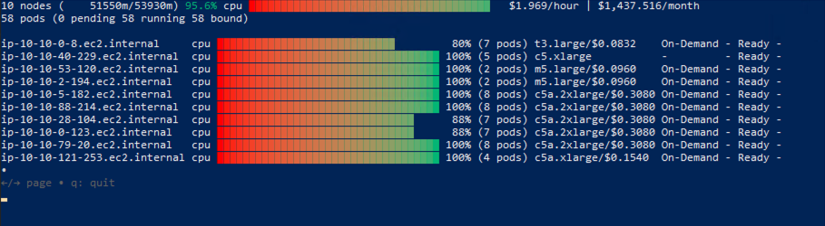

# EKS Node Viewer - Windows Installation and Usage Guide

This guide provides Windows-specific instructions for installing and using EKS Node Viewer.

## 📸 Windows Demo



*eks-node-viewer running on Windows PowerShell with native color support and proper Unicode rendering*

## Prerequisites

### Required Software
- **Go 1.24.2 or later** - See detailed installation instructions below
- **Git** - [Download from git-scm.com](https://git-scm.com/downloads)
- **AWS CLI v2** - [Installation Guide](https://docs.aws.amazon.com/cli/latest/userguide/getting-started-install.html)
- **kubectl** - [Installation Guide](https://kubernetes.io/docs/tasks/tools/install-kubectl-windows/)

### Go Installation (Detailed Steps)

#### Method 1: Using Chocolatey (Recommended)

1. **Install Chocolatey** (if not already installed):
   ```powershell
   # Run PowerShell as Administrator
   Set-ExecutionPolicy Bypass -Scope Process -Force; [System.Net.ServicePointManager]::SecurityProtocol = [System.Net.ServicePointManager]::SecurityProtocol -bor 3072; iex ((New-Object System.Net.WebClient).DownloadString('https://community.chocolatey.org/install.ps1'))
   ```

2. **Install Go using Chocolatey**:
   ```powershell
   # Run PowerShell as Administrator
   choco install golang -y
   ```

3. **Update Environment Variables**:
   ```powershell
   # Import Chocolatey profile to refresh environment
   Import-Module $env:ChocolateyInstall\helpers\chocolateyProfile.psm1
   ```

4. **Close and Reopen PowerShell as Administrator**:
   - **Important**: You must close the current PowerShell window and open a new one as Administrator
   - This is required for the PATH changes to take effect

5. **Verify Installation**:
   ```powershell
   go version
   ```
   Expected output: `go version go1.24.4 windows/amd64` (or similar)

#### Method 2: Manual Installation

1. **Download Go**:
   - Visit [golang.org/downloads](https://golang.org/downloads/)
   - Download the Windows installer (.msi file)

2. **Install Go**:
   - Run the downloaded .msi file
   - Follow the installation wizard
   - Go will be installed to `C:\Program Files\Go` by default

3. **Verify Installation**:
   ```powershell
   # Close and reopen PowerShell, then run:
   go version
   ```

#### Troubleshooting Go Installation

If `go version` returns "command not found":

1. **Check if Go is installed**:
   ```powershell
   Get-ChildItem "C:\Program Files\Go\bin" -ErrorAction SilentlyContinue
   ```

2. **Manually add to PATH** (temporary fix):
   ```powershell
   $env:PATH += ";C:\Program Files\Go\bin"
   go version
   ```

3. **Permanent PATH fix**:
   - Open System Properties → Advanced → Environment Variables
   - Add `C:\Program Files\Go\bin` to your PATH variable
   - Restart PowerShell

### Optional Software
- **Windows Terminal** - Recommended for better color support and Unicode rendering
- **PowerShell 7+** - Enhanced scripting capabilities
- **GoReleaser** - For building releases

## Installation Methods

### Method 1: Pre-built Release (Recommended) ⚡

**This is the fastest and most reliable way to get EKS Node Viewer on Windows:**

1. **Download the release:**
   - Go to [Releases](https://github.com/brunokktro/eks-node-viewer-for-windows/releases/tag/v1.0.0-windows)
   - Download `eks-node-viewer-windows-amd64.zip`

2. **Extract and run:**
   ```powershell
   # Extract the ZIP file
   Expand-Archive -Path eks-node-viewer-windows-amd64.zip -DestinationPath . -Force
   
   # Run the tool
   .\eks-node-viewer.exe
   ```

3. **Verify installation:**
   ```powershell
   .\eks-node-viewer.exe --version
   ```

### Method 2: Build from Source (Advanced Users) 🔧

> **⚠️ Important:** Building from source requires Go installation and can take 5-10 minutes to download all dependencies. Most users should use the pre-built release above.
> 
> **Prerequisites for building:**
> - Go 1.24.2 or later (see Go installation steps below)
> - Git
> - 5-10 minutes for initial build (downloads many dependencies)

**Only proceed with this method if:**
- You want to modify the source code
- You need a specific version not available in releases
- You prefer building from source for security reasons

## Which Installation Method Should I Choose?

| Method | Best For | Time Required | Prerequisites |
|--------|----------|---------------|---------------|
| **Pre-built Release** | Most users, workshops, quick start | 1-2 minutes | None |
| **Build from Source** | Developers, customization | 5-10 minutes | Go installation |

**💡 Recommendation:** Start with the pre-built release. You can always build from source later if needed.

#### Using PowerShell (Recommended)
```powershell
# Ensure Go is installed and accessible
go version

# Clone the repository
git clone https://github.com/brunokktro/eks-node-viewer-for-windows.git
cd eks-node-viewer-for-windows

# Build using the provided PowerShell script
.\build.ps1

# Or build with additional options
.\build.ps1 -Generate -Test
```

#### Using Command Prompt
```cmd
# Ensure Go is installed and accessible
go version

# Clone the repository
git clone https://github.com/brunokktro/eks-node-viewer-for-windows.git
cd eks-node-viewer-for-windows

# Build manually
set CGO_ENABLED=0
go build -ldflags="-s -w -X main.version=local -X main.builtBy=Windows" -o eks-node-viewer.exe ./cmd/eks-node-viewer
```

#### Using Go Install
```cmd
# Ensure Go is installed and accessible
go version

# Install directly from GitHub
go install github.com/brunokktro/eks-node-viewer-for-windows/cmd/eks-node-viewer@latest
```

## Configuration

### AWS Credentials
Ensure your AWS credentials are configured. EKS Node Viewer supports all standard AWS credential methods:

```cmd
# Using AWS CLI
aws configure

# Or set environment variables
set AWS_ACCESS_KEY_ID=your-access-key
set AWS_SECRET_ACCESS_KEY=your-secret-key
set AWS_REGION=us-west-2
```

### Kubernetes Configuration
Ensure kubectl is configured to access your EKS cluster:

```cmd
# Update kubeconfig for your EKS cluster
aws eks update-kubeconfig --region us-west-2 --name your-cluster-name

# Verify connection
kubectl get nodes
```

### Configuration File
Create a configuration file at `%USERPROFILE%\.eks-node-viewer`:

```ini
# Example Windows configuration
node-selector=karpenter.sh/nodepool
resources=cpu,memory
extra-labels=topology.kubernetes.io/zone,karpenter.sh/nodepool
node-sort=creation=asc
style=#2E91D2,#ffff00,#D55E00
```

## Usage

### Basic Usage
```cmd
# Standard usage
.\eks-node-viewer.exe

# With specific options
.\eks-node-viewer.exe --resources cpu,memory --extra-labels topology.kubernetes.io/zone
```

### PowerShell Usage
```powershell
# Standard usage
.\eks-node-viewer.exe

# With AWS profile and region
$env:AWS_PROFILE = "myprofile"
$env:AWS_REGION = "us-west-2"
.\eks-node-viewer.exe
```

### Advanced Examples
```cmd
# Karpenter nodes only
.\eks-node-viewer.exe --node-selector karpenter.sh/nodepool

# Display both CPU and Memory Usage
.\eks-node-viewer.exe --resources cpu,memory

# Display extra labels (AZ)
.\eks-node-viewer.exe --extra-labels topology.kubernetes.io/zone

# Sort by CPU usage in descending order
.\eks-node-viewer.exe --node-sort=eks-node-viewer/node-cpu-usage=dsc

# Disable pricing (faster startup)
.\eks-node-viewer.exe --disable-pricing
```

## Windows-Specific Features

### Terminal Compatibility
- **Command Prompt**: Basic functionality, limited color support
- **PowerShell**: Enhanced color support and Unicode characters
- **Windows Terminal**: Full color support, best experience

### Color Support
EKS Node Viewer automatically detects your terminal capabilities:
- Windows Terminal: Full 24-bit color support
- PowerShell: 16-color support
- Command Prompt: Basic color support

### File Paths
All file paths use Windows conventions:
- Config file: `%USERPROFILE%\.eks-node-viewer`
- Kubeconfig: `%USERPROFILE%\.kube\config`
- Temp files: `%TEMP%\eks-node-viewer-*`

## Troubleshooting

### Common Issues

#### "go is not recognized as an internal or external command"
This is the most common issue when building from source.

**Solution:**
1. Verify Go is installed:
   ```powershell
   Get-ChildItem "C:\Program Files\Go\bin" -ErrorAction SilentlyContinue
   ```

2. If Go is installed but not recognized:
   ```powershell
   # Close current PowerShell and open a new one as Administrator
   # Then test:
   go version
   ```

3. If still not working, manually add to PATH:
   ```powershell
   $env:PATH += ";C:\Program Files\Go\bin"
   go version
   ```

4. For permanent fix, add `C:\Program Files\Go\bin` to your system PATH environment variable

#### "eks-node-viewer is not recognized as an internal or external command"
- Ensure the executable is in your PATH
- Use the full path to the executable: `C:\path\to\eks-node-viewer.exe`

#### Color/Unicode Issues
- Use Windows Terminal for the best experience
- Update to PowerShell 7+ for better Unicode support
- Set console code page: `chcp 65001`

#### AWS Credential Issues
```cmd
# Verify AWS credentials
aws sts get-caller-identity

# Check environment variables
echo %AWS_PROFILE%
echo %AWS_REGION%
```

#### Kubernetes Connection Issues
```cmd
# Verify kubectl configuration
kubectl config current-context
kubectl get nodes

# Update kubeconfig if needed
aws eks update-kubeconfig --region your-region --name your-cluster
```

### Performance Tips
- Use `--disable-pricing` for faster startup
- Use `--node-selector` to filter nodes and improve performance
- Close other resource-intensive applications for better terminal rendering

## Development on Windows

### Building from Source
```powershell
# Install dependencies
go mod download

# Generate code and run tests
.\build.ps1 -Generate -Test

# Build release
.\build.ps1 -Release
```

### Testing
```powershell
# Run all tests
go test ./pkg/... ./cmd/...

# Run tests with coverage
go test -coverprofile=coverage.out ./pkg/... ./cmd/...
go tool cover -html=coverage.out
```

## Support

For Windows-specific issues:
1. Check this documentation first
2. Verify your terminal supports the required features
3. Test with different terminals (CMD, PowerShell, Windows Terminal)
4. Open an issue on [GitHub](https://github.com/awslabs/eks-node-viewer/issues) with:
   - Windows version
   - Terminal type
   - PowerShell/Go versions
   - Complete error messages
